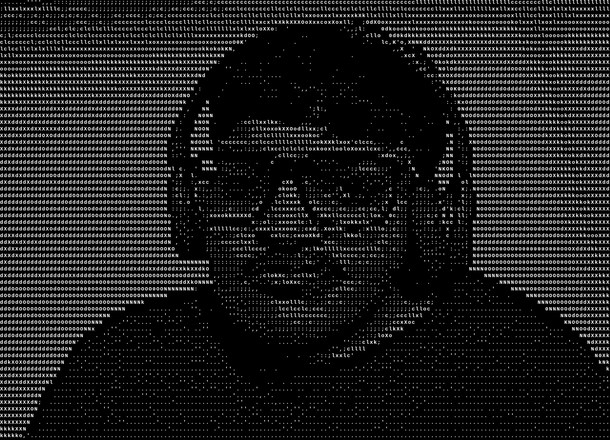

# ⚡ Anas Arfeen

> AI/ML Co-Lead @ Microsoft Innovations Club | Systems & Reinforcement Learning Enthusiast | Linux Customizer

<p align="left">
  
</p>

[](https://www.linkedin.com/in/anas-arfeen-b94870366/)
[](mailto:Codecrusader07@gmail.com)


### 🖥️ System Info

```bash
anas@arfeen
-----------
OS: Arch Linux x86_64
Host: VIT Chennai (B.Tech CSE '29)
Kernel: Reinforcement Learning v2.6.0
Uptime: Coding since age 12 (8+ years)
Shell: zsh + tmux + neovim
Editor: Neovim (lazy.nvim)
AI/ML: PyTorch, RL (PPO, SAC), SB3
Systems: C/C++, Linux kernel optimization
Philosophy: Overengineer responsibly.
```

<br clear="right"/>

---

### 👤 About Me

I'm a Computer Science undergraduate at **VIT Chennai** building things that *think* since before high school. I wrote my first line of code at age 12, and since then I've been hooked on artificial intelligence, reinforcement learning, and the low-level systems that power them. 

My personal philosophy: **love what you do... and overengineer it responsibly.**

---

### 🎓 Education

*   **Vellore Institute of Technology (VIT), Chennai**
    *   **B.Tech in Computer Science Engineering** *(2025 – 2029)*
*   **High School (CBSE)**
    *   **AISSCE (Grade 12)** — *90%*
    *   **AISSE (Grade 10)** — *94%*

---

### 💼 Experience & Leadership

*   **Microsoft Innovations Club (MIC), VIT Chennai** — **AI/ML Co-Lead** *(2026 - Present)*
    *   Orchestrate AI/ML workshops and technical initiatives for the student community.
    *   Mentor students in modern development workflows, AI tooling, and project-building.
    *   Direct technical planning and automate event execution tasks.
    *   *AI/ML Member (2025 - 2026)* — Contributed to collaborative projects and learning sessions.
*   **Linux User Group (LUG), VIT Chennai** — **Technical Member** *(2025 - 2026)*
    *   Advocated open-source ecosystems and optimized terminal-based developer productivity workflows.
*   **Hack Club, VIT Chennai** — **AI/ML Member** *(2025 - Present)*
    *   Engaged in student-led development initiatives and collaborative coding activities.

---

### 🛠️ Tech Stack

<p align="left">
  <strong>Languages:</strong><br/>
  <a href="https://python.org"></a>
  <a href="https://isocpp.org"></a>
  <a href="https://en.wikipedia.org/wiki/C_(programming_language)"></a>
  <a href="https://learn.microsoft.com/en-us/dotnet/csharp/"></a>
  <a href="https://developer.mozilla.org/en-US/docs/Web/JavaScript"></a>
  <a href="https://godotengine.org"></a>
  <a href="https://developer.mozilla.org/en-US/docs/Web/HTML"></a>
  <a href="https://developer.mozilla.org/en-US/docs/Web/CSS"></a>
</p>

<p align="left">
  <strong>AI & Machine Learning:</strong><br/>
  <a href="https://pytorch.org"></a>
  <a href="https://stable-baselines3.readthedocs.io"></a>
  <a href="https://numpy.org"></a>
</p>

<p align="left">
  <strong>Tools & Environments:</strong><br/>
  <a href="https://www.linux.org"></a>
  <a href="https://git-scm.com"></a>
  <a href="https://neovim.io"></a>
  <a href="https://code.visualstudio.com"></a>
  <a href="https://www.pygame.org"></a>
</p>

<p align="left">
  <strong>Core Areas:</strong><br/>
  <code>Reinforcement Learning (PPO, SAC)</code> · <code>Systems Programming</code> · <code>OOP & DSA</code> · <code>Performance Optimization</code> · <code>Environment Design</code>
</p>

---

### 📂 Projects & Labs

```bash
anas@arfeen:~ $ tree --level 2 ~/projects/
~/projects
├── 🤖 autonomous-warehouse-rover [Python | PyTorch | Stable-Baselines3]
│   ├── Navigation agent trained via Proximal Policy Optimization (PPO)
│   ├── Curriculum learning strategies for complex warehouse sim layouts
│   └── Custom simulation environment engineered using MVC architecture
├── 🎵 musical-term [Python | Curses]
│   └── Aesthetic terminal music player tailored for command-line workflows
├── 📶 campus-signal-mapper [HTML | JavaScript | CSS]
│   ├── Crowd-sourced cell carrier performance mapping for VIT Chennai
│   └── Interactive frontend with dynamic heatmap generation
├── 🎭 celeb-classifier [Python | PyTorch | ResNet50]
│   └── AI-powered facial similarity matching app (GNU GPL v3)
└── 🐍 snake-ai [Python | Pygame]
    └── Automated Snake bot powered by A* and Greedy search algorithms
```

#### Detailed Breakdown:

*   **🤖 Autonomous Warehouse Rover**
    *   Engineered a reinforcement learning agent utilizing Proximal Policy Optimization (PPO) for autonomous navigation.
    *   Implemented curriculum learning strategies to train the agent on increasingly complex warehouse layouts.
    *   Developed a custom environment simulation and rendering system using MVC architecture from the ground up.
*   **🎵 MusicalTerm**
    *   Developed an aesthetic terminal-based music player tailored for command-line focused workflows.
*   **📶 Campus Signal Mapper**
    *   Built a crowd-sourced visualization tool to map mobile carrier performance across the VIT Chennai campus.
    *   Developed an interactive frontend for real-time signal data collection and dynamic heatmap generation.
*   **🎭 Celeb Classifier**
    *   Architected an AI-powered web application using ResNet50 for high-accuracy facial similarity matching.
    *   Open-sourced the project under GNU GPL v3 to encourage community contributions and transparency.
*   **🐍 Snake - AI Edition**
    *   Reconstructed the classic Snake game featuring an automated bot driven by Greedy and A* search algorithms.
    *   Improved pathfinding efficiency for real-time decision-making in dynamic environments.

---

### 🧠 Philosophy & Musings

> 💡 *"If my code doesn't work… it's probably a race condition. Or the hardware. Mostly the hardware."* 🙃

*   **Optimization First:** If it can be optimized, I will optimize it.
*   **Overengineering Hobby:** If it can be overengineered… I probably already did.
*   **Craftsmanship:** The best code is code you're proud of — not just code that runs.
*   **Passion:** Love what you code. Code what you love.

---

### ☕ Interests & Hobbyist Pursuits

`Linux Customization` · `Terminal Ricing` · `Experimental Coding` · `Coffee Culture` · `Music` · `Story-Driven Games` · `Online Tech Communities`

---

```bash
anas@arfeen:~ $ ping -c 1 social.anas.arfeen
```

*   📧 **Email:** [codecrusader07@gmail.com](mailto:codecrusader07@gmail.com)
*   💼 **LinkedIn:** [Anas Arfeen](https://www.linkedin.com/in/anas-arfeen-b94870366/)
*   🌐 **GitHub:** [Anasarfeen123](https://github.com/Anasarfeen123)

*If you've got a wild idea, a challenging problem, or want to chat about AI & systems, feel free to reach out. I'm probably already thinking about something similar!*
